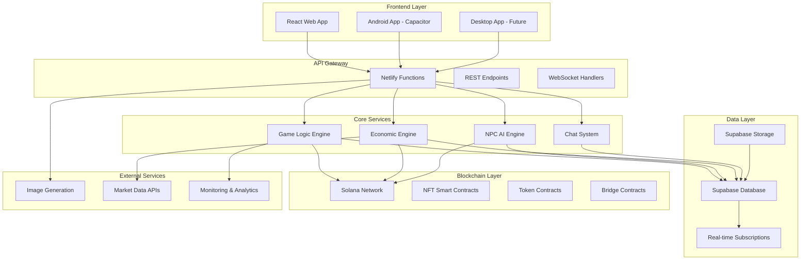

# Earth 2089 Architecture Overview

## System Overview

Earth 2089 is a comprehensive Web3 MMORPG built on a modern, scalable architecture that seamlessly integrates traditional gaming systems with blockchain technologies. The architecture supports real-time multiplayer interactions, autonomous AI characters, and a player-driven economy.

## High-Level Architecture



## Component Breakdown

### Frontend Layer

#### **React Web Application & Android App**

- **Technology**: React 19 with TypeScript
- **State Management**: React Context + Custom Hooks
- **Styling**: Tailwind CSS with shadcn/ui components
- **Wallet Integration**: Solana Wallet Adapter
- **Real-time**: Supabase subscriptions for live updates

**Key Features:**

- Responsive design for desktop and mobile
- Real-time game state synchronization
- Interactive world map (SVG-based)
- Comprehensive admin dashboard
- Multi-wallet support (Phantom, Solflare, etc.)
- Native Android app via Capacitor
- Solana Mobile Stack compatibility

#### **Component Architecture**

```
src/
├── components/
│   ├── views/           # Main game screens
│   ├── ui/              # Reusable UI components
│   ├── admin/           # Admin dashboard
│   ├── map/             # World map components
│   └── screens/         # Screen-level components
├── hooks/               # Custom React hooks
├── providers/           # Context providers
├── contexts/            # React contexts
└── lib/                 # Utility libraries
```

### API Gateway

#### **Netlify Functions (Serverless)**

- **Runtime**: Node.js with TypeScript support
- **Deployment**: Automatic deployment via Git
- **Scaling**: Auto-scaling based on demand
- **Security**: Environment-based configuration

**API Endpoints:**

- Character management (creation, updates, queries)
- Game actions (mining, travel, trading)
- Economic functions (bridge, exchange, markets)
- Social features (chat, player discovery)
- Admin operations (data management, monitoring)

#### **API Design Patterns**

```typescript
// Standard API Response Format
interface APIResponse<T> {
  success: boolean
  data?: T
  error?: string
  timestamp: string
}

// Error Handling Pattern
try {
  const result = await performGameAction(params)
  return { success: true, data: result }
} catch (error) {
  return { success: false, error: error.message }
}
```

### Core Services

#### **Game Logic Engine**

Manages core game mechanics and player interactions:

- **Character Systems**: Health, energy, experience, leveling
- **Activity Processing**: Mining, travel, equipment management
- **World State**: Location data, resource availability
- **Progression Systems**: Experience gain, skill advancement

#### **NPC AI Engine**

Autonomous character management system:

- **Personality-Driven Behavior**: 5 distinct personality types
- **Activity Coordination**: 9 different behavior modes
- **Economic Participation**: NPCs contribute to game economy
- **Social Interaction**: Contextual chat and communication

#### **Economic Engine**

Comprehensive economic management:

- **EARTH Token Management**: In-game currency operations
- **Market Systems**: Dynamic pricing and trade facilitation
- **Bridge Operations**: Blockchain ↔ game balance conversion
- **Economic Analytics**: Real-time economic monitoring

#### **Chat System**

Real-time communication infrastructure:

- **Location-Based Channels**: Area-specific conversations
- **Message Routing**: Efficient delivery to relevant players
- **Content Moderation**: Automated filtering and controls
- **Integration**: Seamless NPC participation

### Data Layer

#### **Supabase Database (PostgreSQL)**

Primary data store with real-time capabilities:

**Core Tables:**

- `characters` - Player and NPC character data
- `locations` - World geography and features
- `items` - Game items and equipment
- `transactions` - Activity and economic logs
- `chat_messages` - Communication history
- `market_listings` - Trading marketplace data

**Advanced Features:**

- Row Level Security (RLS) for data protection
- Real-time subscriptions for live updates
- Automated backups and point-in-time recovery
- Geographic distribution for global performance

#### **Supabase Storage**

Asset management for game content:

- **Character Images**: Procedurally generated character art
- **Game Assets**: UI elements, icons, textures
- **User Content**: Player-uploaded content (future)
- **Optimized Delivery**: CDN distribution for performance

#### **Real-time Architecture**

```typescript
// Real-time subscription example
useEffect(() => {
  const subscription = supabase
    .channel('game-updates')
    .on(
      'postgres_changes',
      {
        event: 'INSERT',
        schema: 'public',
        table: 'chat_messages',
        filter: `location_id=eq.${currentLocation}`,
      },
      (payload) => {
        addNewMessage(payload.new)
      }
    )
    .subscribe()

  return () => subscription.unsubscribe()
}, [currentLocation])
```

### Blockchain Layer

#### **Solana Integration**

High-performance blockchain for gaming:

- **Fast Transactions**: ~400ms confirmation times
- **Low Fees**: Minimal cost for micro-transactions
- **Parallel Processing**: High throughput for multiple operations
- **Developer Ecosystem**: Rich tooling and library support

#### **Smart Contract Architecture**

```
Blockchain Contracts:
├── Character NFTs      # Metaplex-based character tokens
├── Item NFTs          # Equipment and item tokenization
├── EARTH Token        # SPL token for in-game currency
├── Bridge Contract    # Game ↔ blockchain asset transfer
└── Governance        # Future: DAO and voting systems
```

#### **Wallet Management**

- **Player Wallets**: Self-custody via wallet adapters
- **NPC Wallets**: Encrypted storage with secure key management
- **Treasury Wallet**: Central funding and operations management
- **Multi-signature**: Enhanced security for critical operations

### External Services

#### **Image Generation System**

Procedural character creation:

- **Layer-based Rendering**: Modular character appearance system
- **Asset Libraries**: Extensive clothing, accessories, and features
- **Compatibility Rules**: Logical restrictions for realistic combinations
- **Performance Optimization**: Efficient rendering and caching

#### **Market Data Integration**

Real-time economic information:

- **SOL Price Feeds**: Current cryptocurrency market data
- **Exchange Rate APIs**: Multi-currency conversion support
- **Economic Indicators**: Market trend analysis and reporting
- **Risk Management**: Volatility monitoring and alerts

## Security Architecture

### **Data Protection**

- **Encryption at Rest**: Database and storage encryption
- **Encryption in Transit**: TLS/SSL for all communications
- **API Security**: Rate limiting and input validation
- **Environment Isolation**: Separate development/production environments

### **Wallet Security**

- **Private Key Management**: Never stored on servers
- **Encrypted NPC Wallets**: AES-256-CBC encryption with master keys
- **Transaction Signing**: Client-side signing for security
- **Multi-signature Support**: Enhanced protection for large operations

### **Access Control**

- **Role-Based Permissions**: Admin, player, and system roles
- **Row-Level Security**: Database-level access controls
- **API Authentication**: Token-based authentication systems
- **Audit Logging**: Comprehensive activity tracking

## Performance & Scalability

### **Frontend Optimization**

- **Code Splitting**: Lazy loading for optimal bundle sizes
- **Asset Optimization**: Compressed images and efficient loading
- **Caching Strategies**: Service workers and browser caching
- **Real-time Efficiency**: Optimized subscription management

### **Backend Scalability**

- **Serverless Architecture**: Auto-scaling based on demand
- **Database Optimization**: Efficient queries and indexing
- **Connection Pooling**: Managed database connections
- **Caching Layers**: Redis integration for frequently accessed data

### **Blockchain Efficiency**

- **Transaction Batching**: Multiple operations in single transactions
- **Priority Fee Management**: Optimal transaction processing
- **Error Recovery**: Robust retry mechanisms for failed operations
- **Gas Optimization**: Efficient smart contract interactions

## Monitoring & Analytics

### **System Monitoring**

- **Application Performance**: Response times and error rates
- **Database Performance**: Query optimization and slow query detection
- **Blockchain Monitoring**: Transaction success rates and fee tracking
- **User Experience**: Frontend performance and user journey tracking

### **Game Analytics**

- **Player Behavior**: Activity patterns and engagement metrics
- **Economic Health**: Token circulation and market activity
- **System Usage**: Feature adoption and performance insights
- **Predictive Analytics**: Trend analysis and forecasting

### **Alerting Systems**

- **Critical Error Alerts**: Immediate notification of system issues
- **Performance Degradation**: Early warning for performance issues
- **Economic Anomalies**: Unusual market activity detection
- **Security Incidents**: Suspicious activity monitoring

## Development & Deployment

### **Development Workflow**

```
Development → Testing → Staging → Production

├── Local Development
│   ├── Hot reloading
│   ├── Local database
│   └── Test blockchain
│
├── Testing Environment
│   ├── Automated testing
│   ├── Integration tests
│   └── Performance testing
│
├── Staging Environment
│   ├── Production-like setup
│   ├── Final validation
│   └── Load testing
│
└── Production Environment
    ├── Blue-green deployment
    ├── Monitoring & alerting
    └── Rollback capabilities
```

### **Quality Assurance**

- **Automated Testing**: Unit, integration, and end-to-end tests
- **Code Quality**: ESLint, Prettier, and TypeScript strict mode
- **Security Scanning**: Automated vulnerability detection
- **Performance Testing**: Load testing and optimization validation

### **Deployment Strategy**

- **Continuous Integration**: Automated building and testing
- **Continuous Deployment**: Automated deployment to staging/production
- **Feature Flags**: Gradual feature rollout and A/B testing
- **Rollback Procedures**: Quick recovery from deployment issues

## Future Architecture Considerations

### **Planned Enhancements**

- **Multi-Chain Support**: Expansion beyond Solana ecosystem
- **Mobile Applications**: Native iOS and Android apps
- **Advanced AI**: Machine learning for enhanced NPC behavior
- **Decentralized Storage**: IPFS integration for asset distribution

### **Scalability Roadmap**

- **Microservices Migration**: Breaking monolithic functions into services
- **Global Distribution**: Multi-region deployment for worldwide players
- **Advanced Caching**: Distributed caching for improved performance
- **Edge Computing**: Processing closer to users for reduced latency

## Conclusion

The Earth 2089 architecture represents a sophisticated, scalable foundation for Web3 gaming. By combining modern web technologies with blockchain innovation, the system delivers a seamless gaming experience while maintaining the security, performance, and scalability requirements of a successful MMORPG.

The modular design allows for independent scaling and development of different system components, while the comprehensive monitoring and security measures ensure reliable operation as the player base grows.

---

\*This architecture overview provides a high-level understanding of system design.
